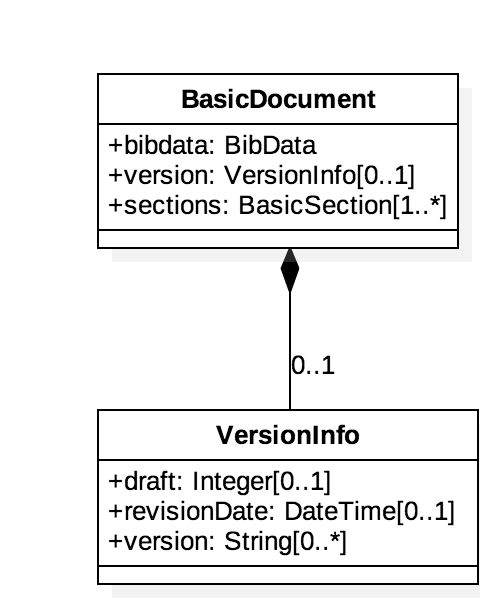
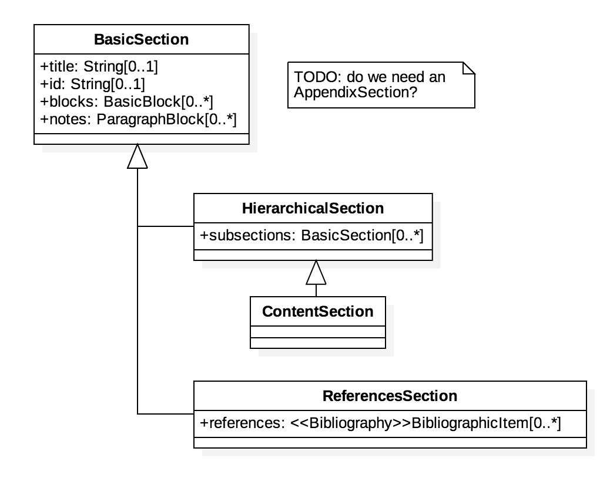
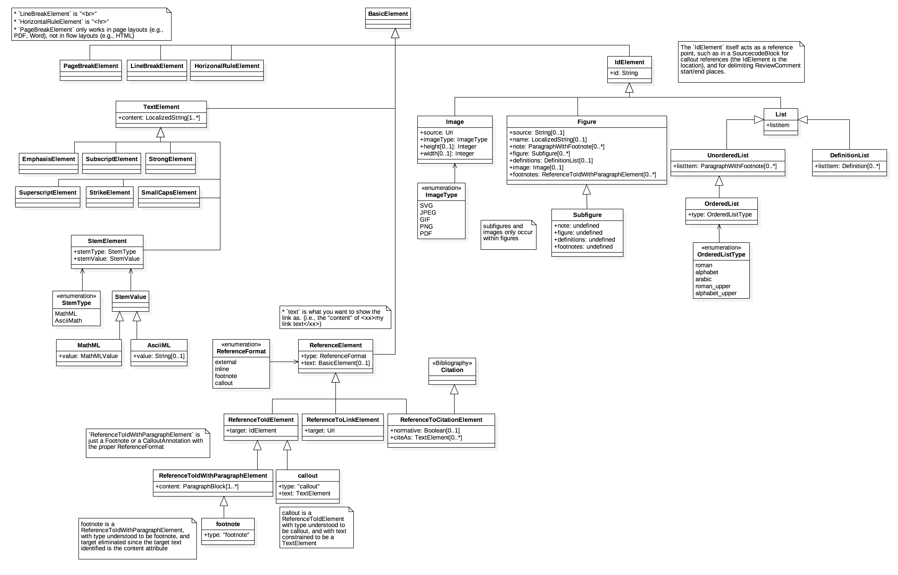

= BasicDocument Models

BasicDocument is a family of document models that forms the basis of IsoDoc
(via StanDoc), which is used to represent ISO Standards and similarly structured
standards.

It is also the document model that Selagraph operates on.

Bibliography UML models are located here:
https://github.com/riboseinc/bib-models[BibModels]

BasicDocument itself is a document model that can serve as a transit data
structure for document conversion, such as taking input from AsciiDoc or
Markdown and converting them into an output format,
such as https://github.com/riboseinc/isodoc[IsoDoc]

== Standard Document UML Models

=== BasicDocument

=== BibData

image::images/bibdata.png[]

=== Sections

=== Blocks

image::images/blocks.png[]

=== Text

=== Data Types

image::images/datatypes.png[]
