= BasicDocument / SecureDoc Models

image:https://github.com/metanorma/basicdoc-models/workflows/rake/badge.svg["Build Status", link="https://github.com/metanorma/basicdoc-models/actions?query=workflow%3Arake"]

BasicDocument ("BasicDoc") / SecureDoc is a set of core information models that
represents a document, including metadata and rich text.

BasicDocument is a document model that can serve as a transit data structure
for document (with rich-text) conversion, such as taking input from AsciiDoc or
Markdown and converting them into an output format like Metanorma StandDoc.

Its rich-text models act as a superset to the semantic elements of HTML and
RTF, and therefore can fully represent the semantics of either format.

BasicDocument also provides models relating to document changes (i.e.
"document/content patches"), which can be used in the case of collaborative
transformation operations.

NOTE: BasicDocument is the document model that Selagraph operates on.

[IMPORTANT]
====
The models ARE the LML files. Every model is defined in LutaML
(`models/**/*.lml` definition modules, `views/*.lml` diagram views); the RNC
files in `grammars/` are implementation grammars that *accompany* the LML
models — never a substitute for them. This cannot be violated.
====

This repository is the sole source of Basicdoc LML. Consumers
(https://github.com/relaton/relaton-models[relaton-models],
https://github.com/metanorma/standoc-models[standoc-models]) submodule it —
do not vendor Basicdoc types elsewhere.

The Relaton Bibliography models used alongside these models live in:

* https://github.com/relaton/relaton-models[relaton/relaton-models]
  (base grammars under `relaton/grammars/`)

RNG compilation of the accompanying RNC is handled by the Metanorma grammar
hub (standoc-models), not by this repository.

== Building

Requires Ruby, Bundler, and Graphviz (`dot` on `PATH`).

[source,sh]
----
git submodule update --init --recursive
bundle install
bundle exec rake render   # regenerate images/*.png from views/*.lml
bundle exec rake verify   # assert PNG magic bytes on every committed diagram
bundle exec rake parity   # assert LML/RNC presence and view include graph
bundle exec rake check    # render + verify + parity
bundle exec rake clean
----

CI runs the same build on ubuntu, macOS and Windows.

== Basic Document UML Models

=== BasicDocument

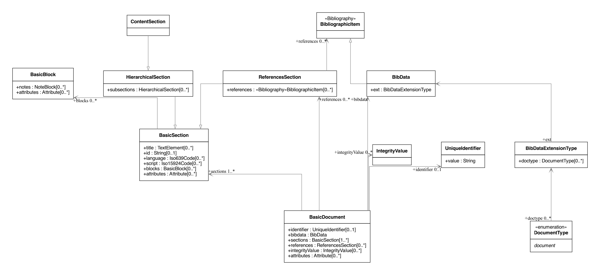

=== BibData

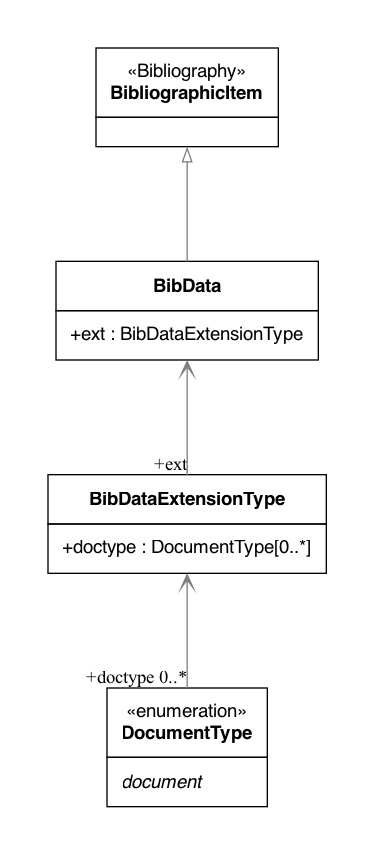

=== ContribMetadata

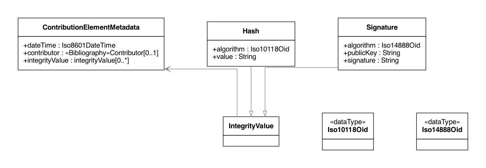

=== Sections

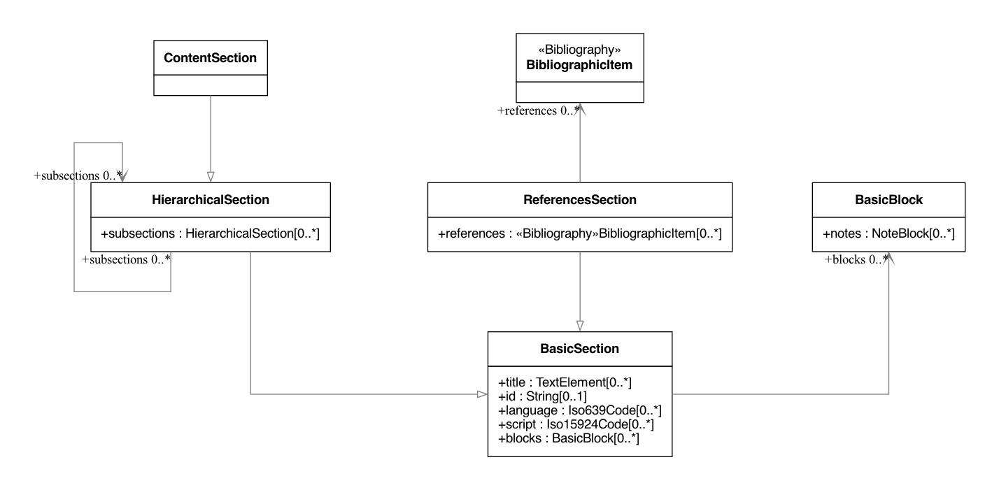

=== Blocks

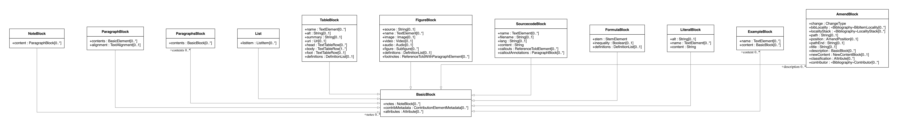

=== Paragraphs

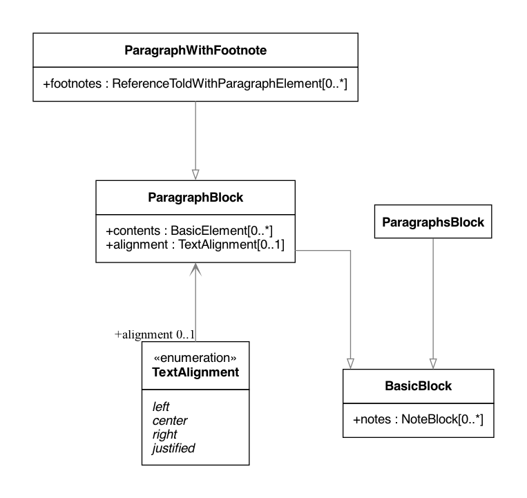

=== Multi-Paragraphs

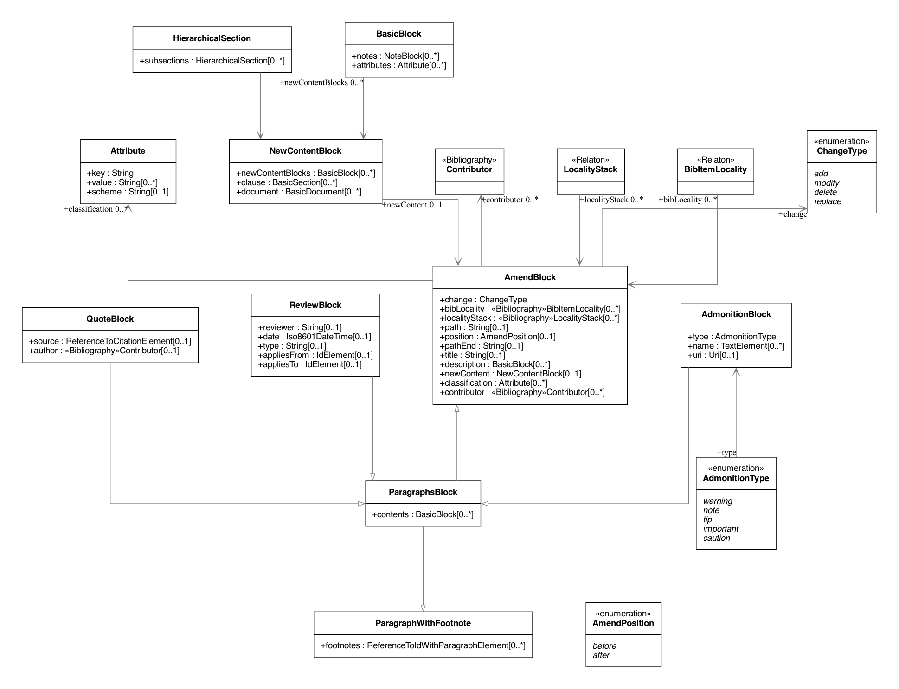

=== Lists

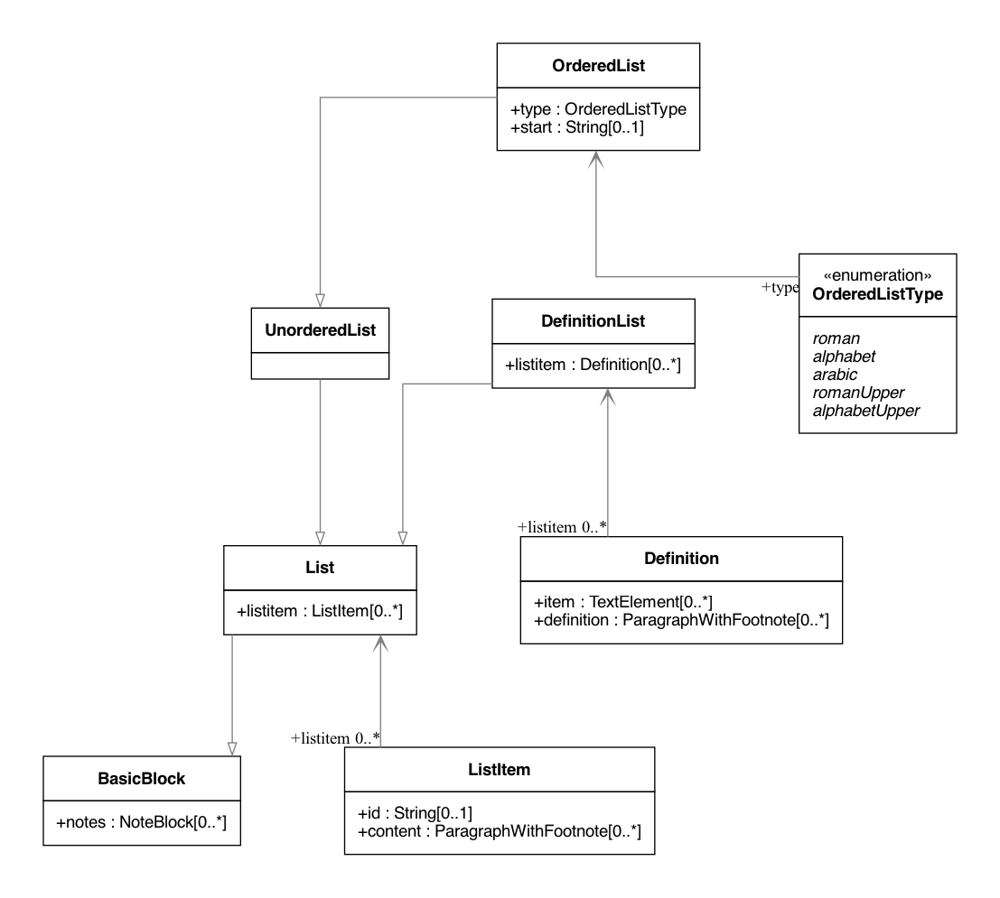

=== Table

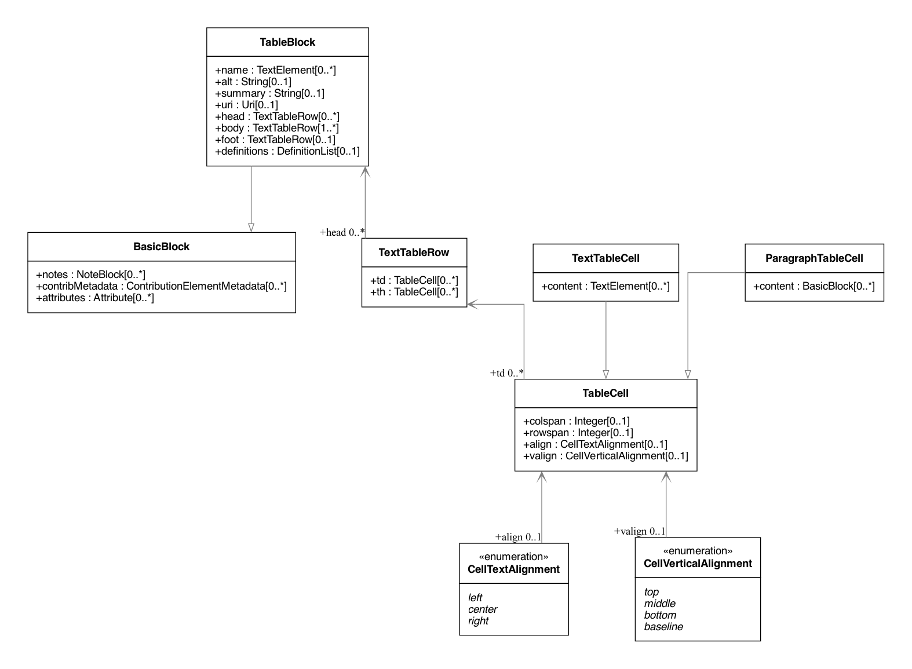

=== Ancillary Blocks

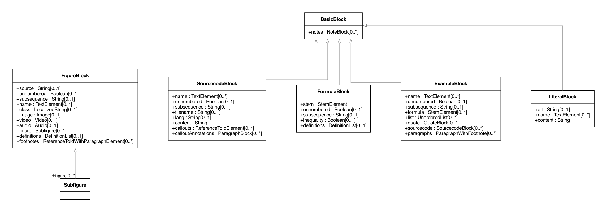

=== IdElements

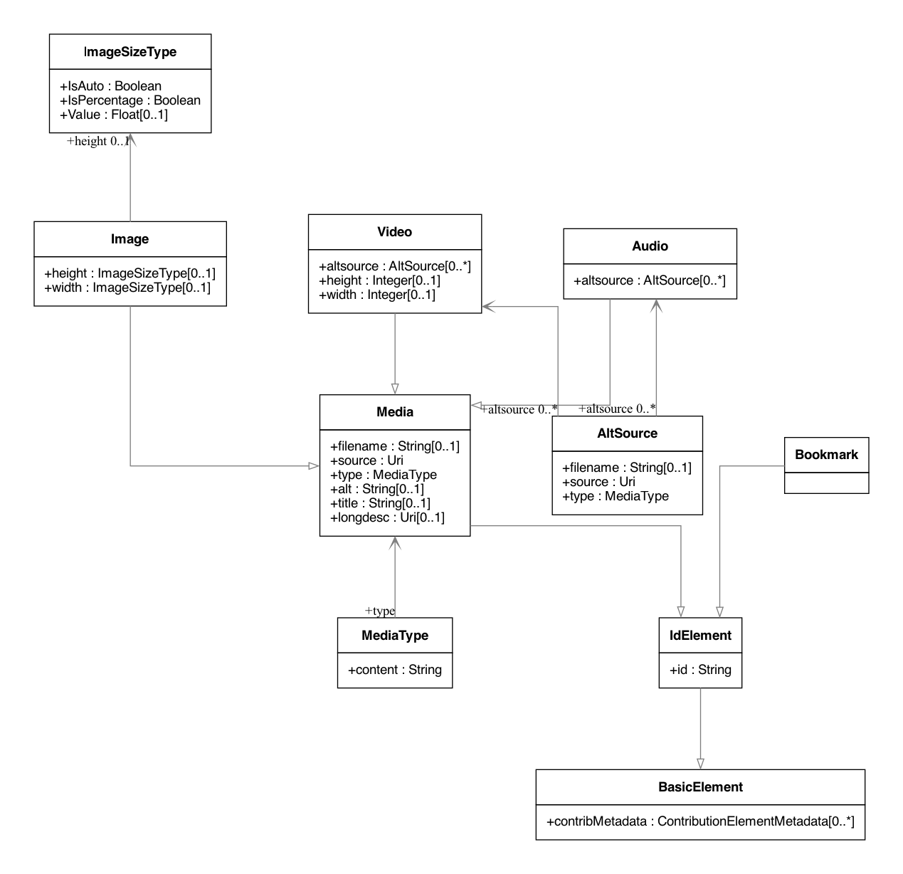

=== TextElements

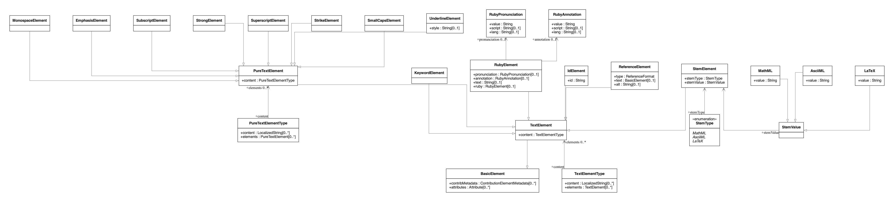

=== EmptyElements

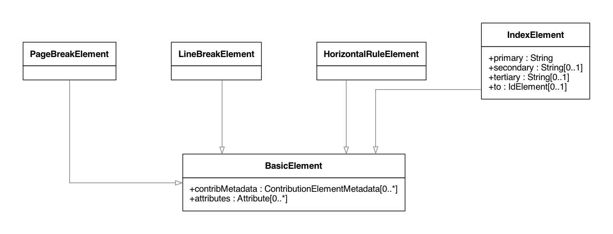

=== ReferenceElements

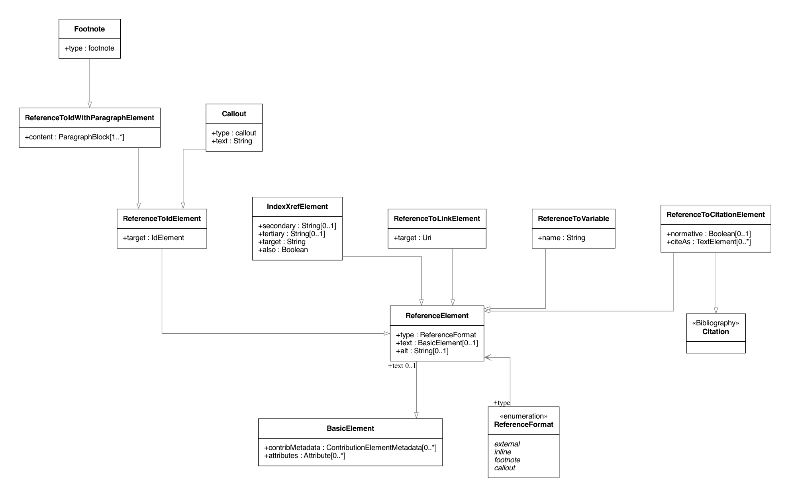

=== Changes

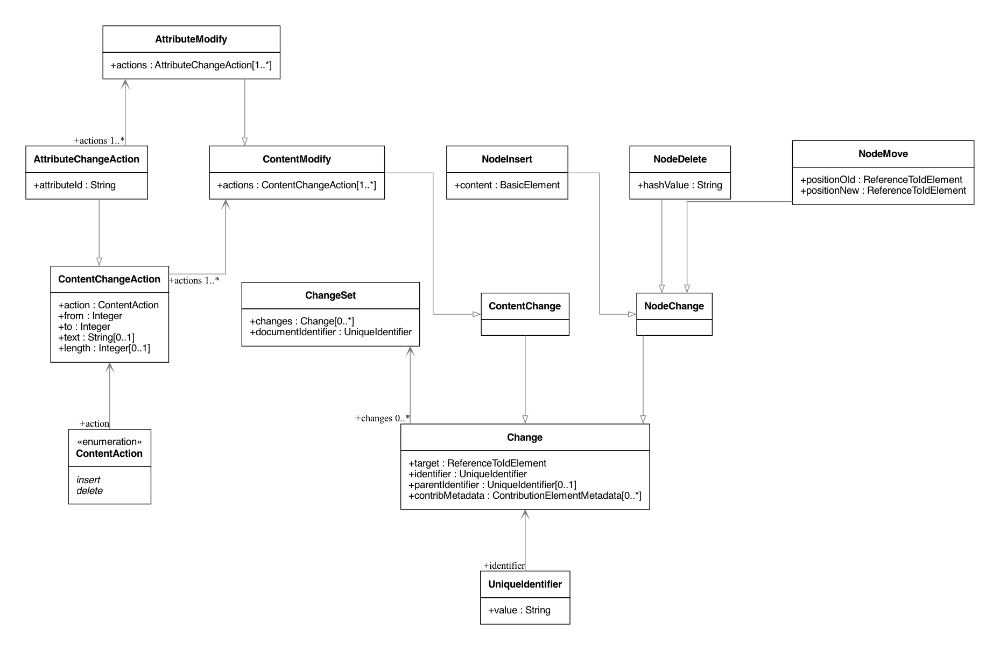

=== Data Types

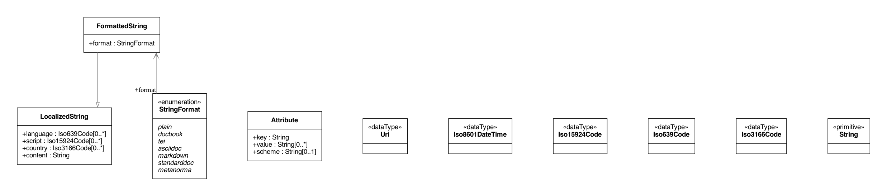
