= BasicDocument / SecureDoc Models

image:https://github.com/metanorma/basicdoc-models/workflows/make/badge.svg["Build Status", link="https://github.com/metanorma/basicdoc-models/actions?query=workflow%3Amake"]

BasicDocument ("BasicDoc") / SecureDoc is a set of core information models that
represents a document, including metadata and rich text.

BasicDocument is a document model that can serve as a transit data structure
for document (with rich-text) conversion, such as taking input from AsciiDoc or
Markdown and converting them into an output format like Metanorma StandDoc.

Its rich-text models act as a superset to the semantic elements of HTML and
RTF, and therefore can fully represent the semantics of either format.

BasicDocument also provides models relating to document changes (i.e.
"document/content patches"), which can be used in the case of collaborative
transformation operations.

NOTE: BasicDocument is the document model that Selagraph operates on.

The Relaton Bibliography UML models used in these models are located here:

* https://github.com/metanorma/relaton-models[Relaton BibModels]

== Basic Document UML Models

=== BasicDocument

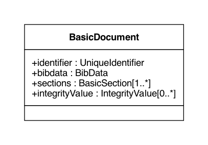

=== BibData

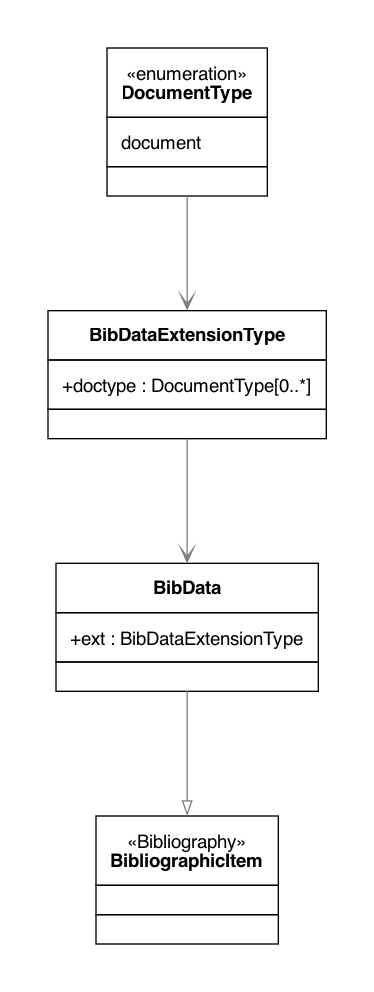

=== ContribMetadata

=== Sections

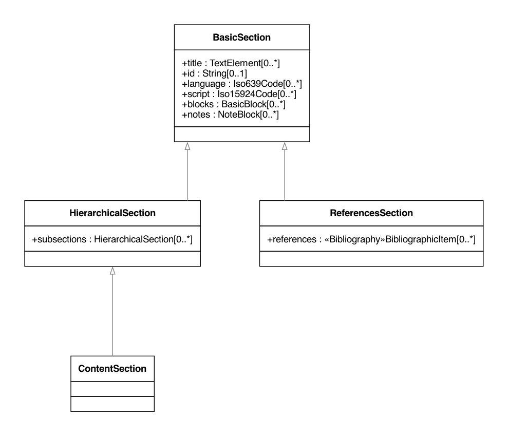

=== Blocks

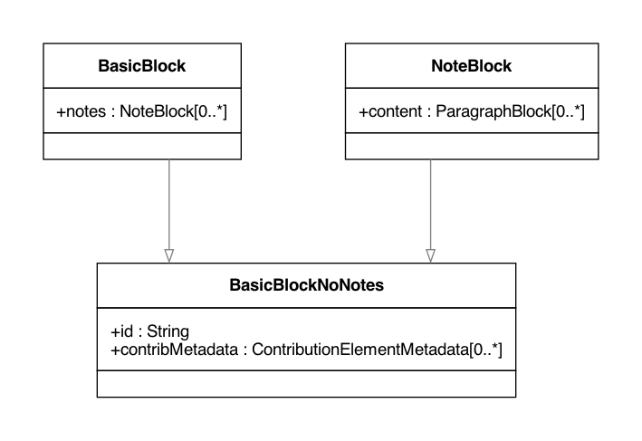

=== Paragraphs

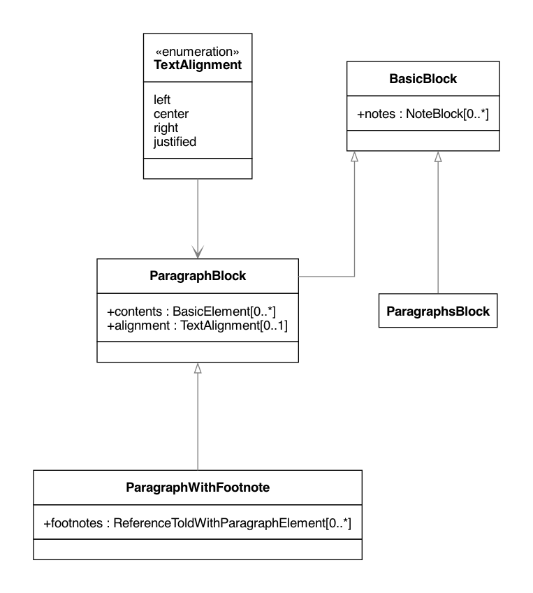

=== Multi-Paragraphs

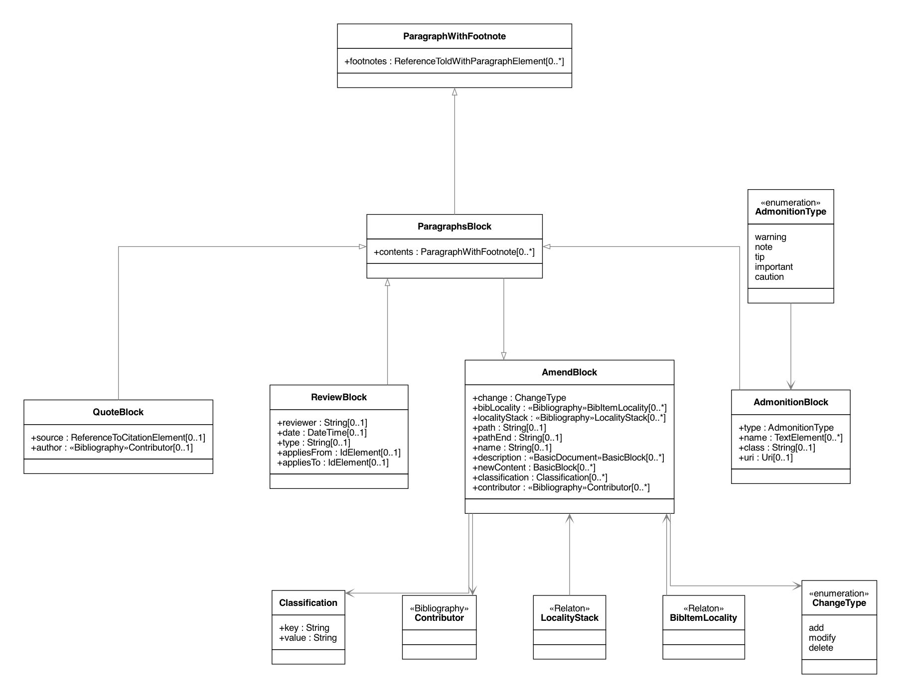

=== Lists

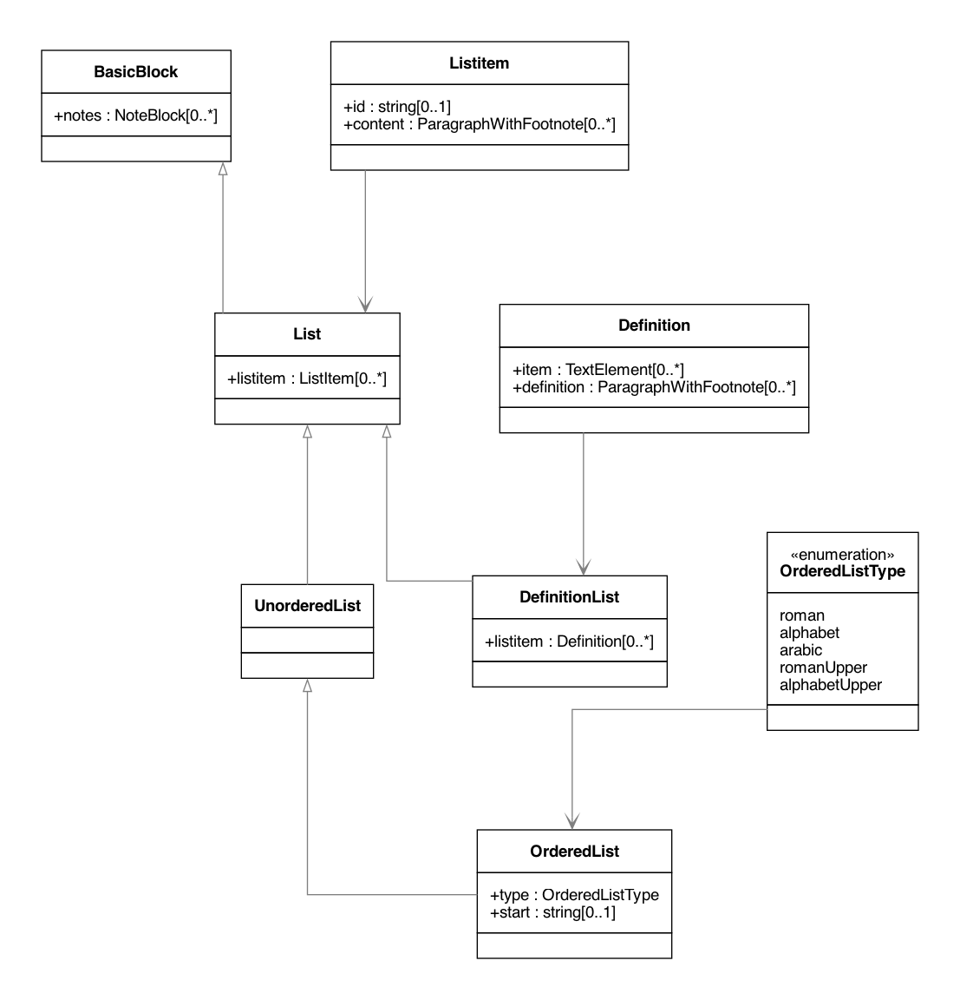

=== Table

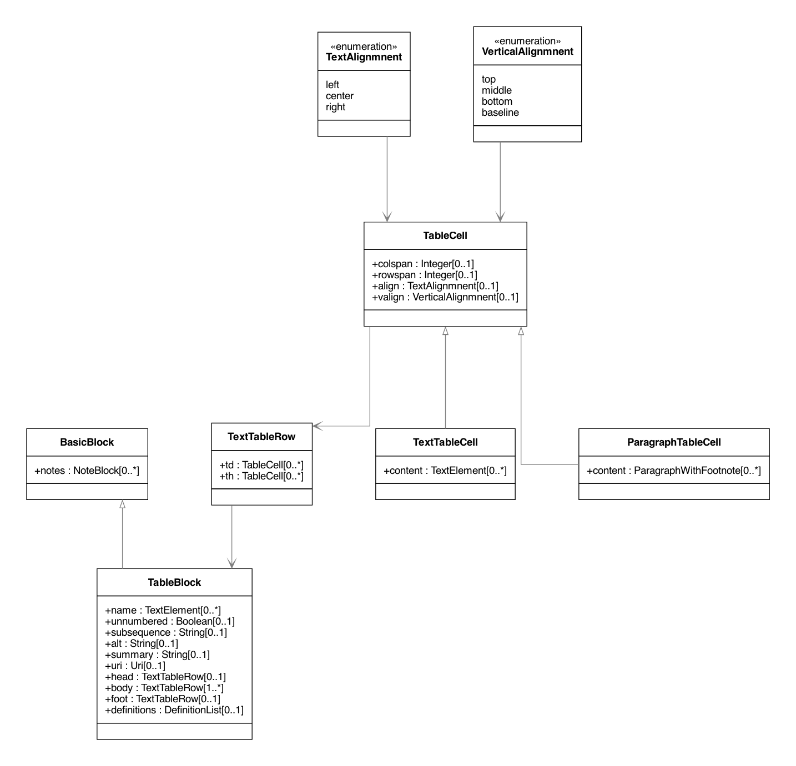

=== Ancillary Blocks

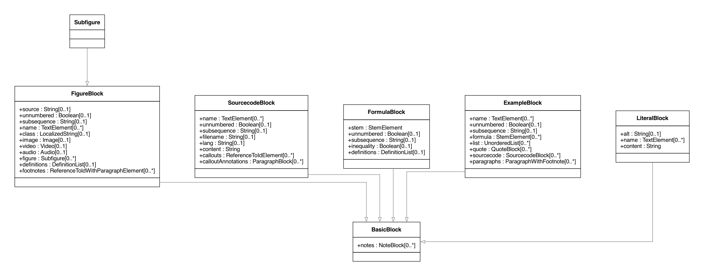

=== IdElements

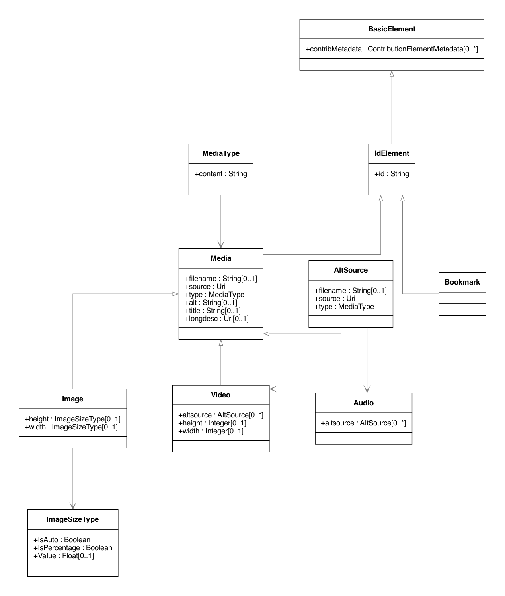

=== TextElements

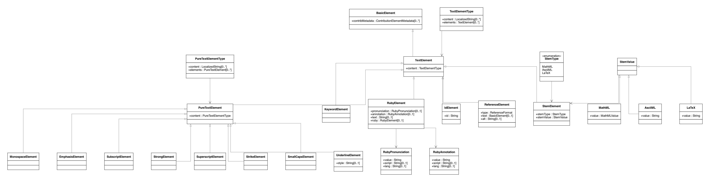

=== EmptyElements

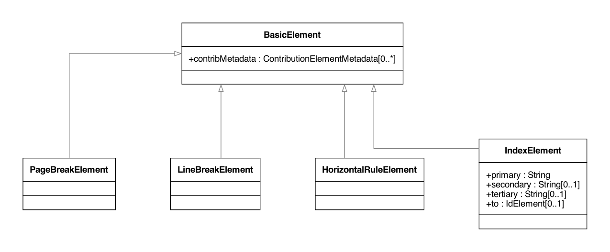

=== ReferenceElements

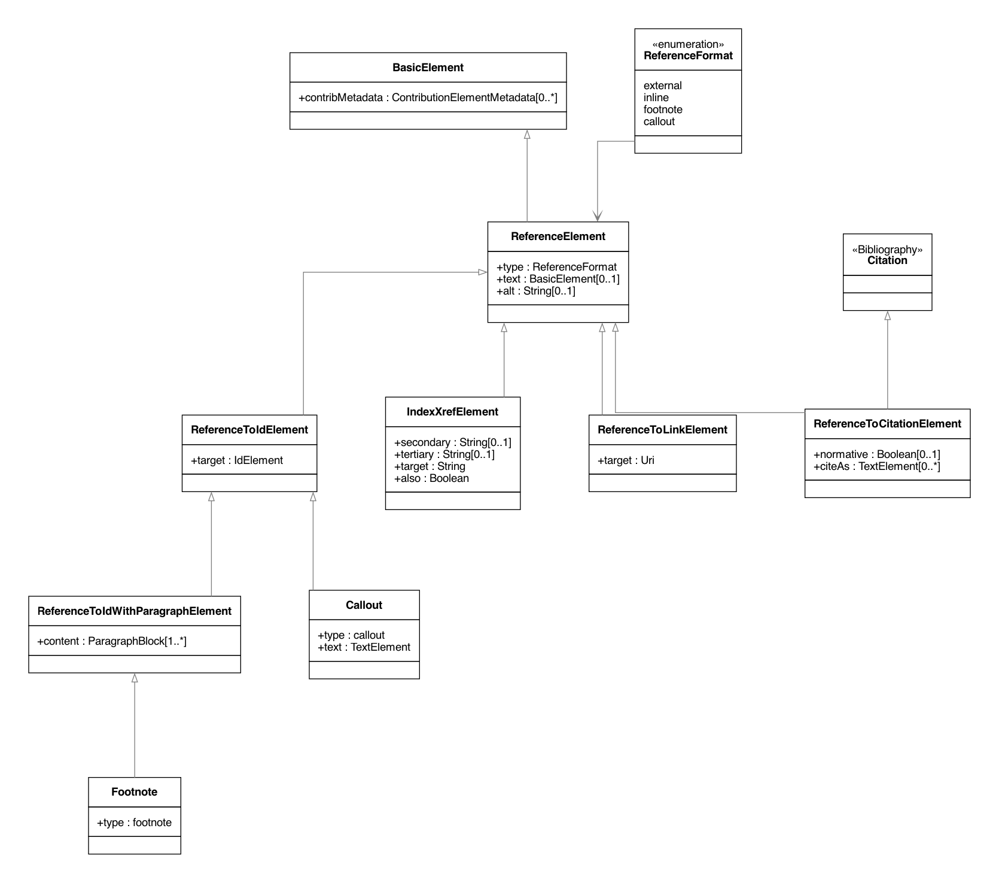

=== Changes

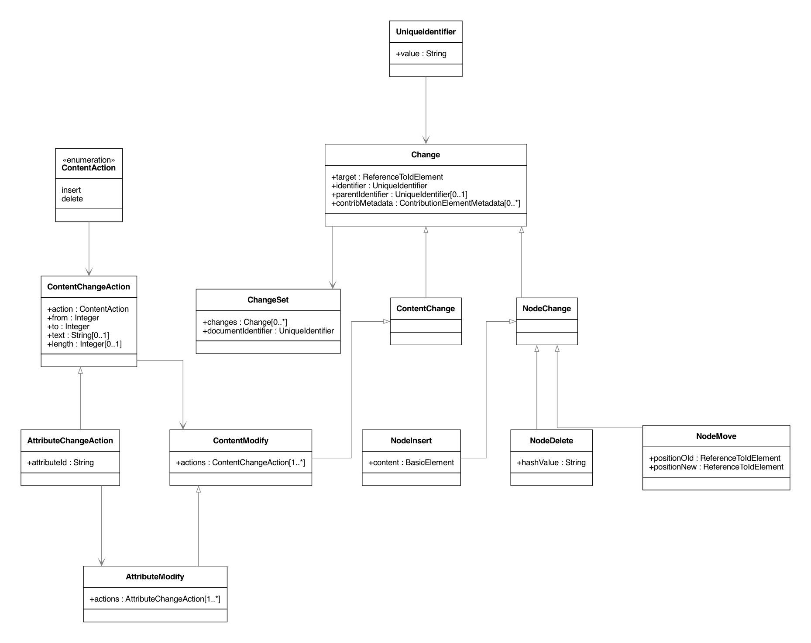

=== Data Types

image::images/DataTypes.png[]
