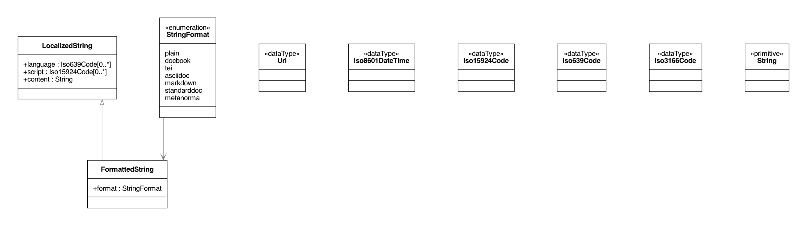

= BasicDocument / SecureDoc Models

BasicDocument / SecureDoc is a family of document models that forms the basis of Metanorma IsoDoc
(via Metanorma StandardDocument), which is used to represent ISO Standards and similarly structured
standards.

It is also the document model that Selagraph operates on.

The Relaton Bibliography UML models used in these models are located here:
https://github.com/riboseinc/bib-models[Relaton BibModels]

BasicDocument itself is a document model that can serve as a transit data
structure for document conversion, such as taking input from AsciiDoc or
Markdown and converting them into an output format,
such as https://github.com/riboseinc/isodoc[Metanorma IsoDoc]

== Standard Document UML Models

=== BasicDocument

image::images/BasicDocument.png[]

=== BibData

image::images/BibData.png[]

=== Sections

image::images/Sections.png[]

=== Blocks

image::images/Blocks.png[]

=== IdElements

image::images/IdElements.png[]

=== TextElements

image::images/TextElements.png[]

=== ReferenceElements

image::images/ReferenceElements.png[]

=== Change

image::images/Change.png[]

=== Data Types

